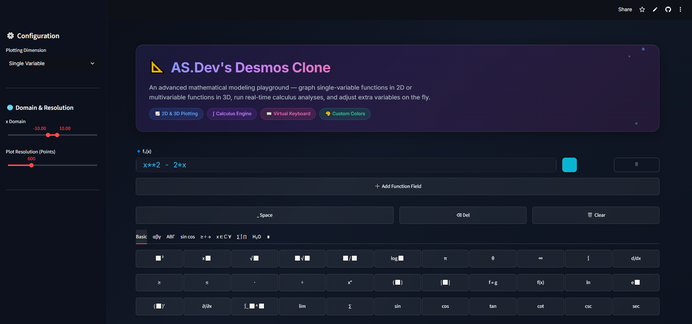
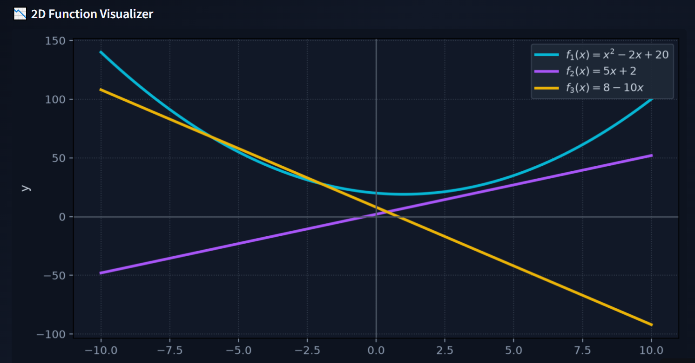
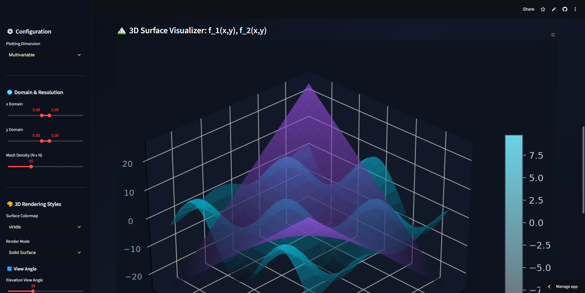

# 📐 AS.Dev's Desmos Clone
[](https://desmos-clone-asdev.streamlit.app/)
<br/>
A premium, interactive mathematical graphing calculator built with **Streamlit**, **SymPy**, **Matplotlib**, and **NumPy**. Visualize single-variable functions in 2D or multivariable functions in 3D — with real-time calculus analysis, a virtual math keyboard, and a polished glassmorphic dark UI.

<p align="center">
  
</p>


---


## ✨ Features

### 📈 2D & 3D Function Plotting
- Graph **single-variable** functions `f(x)` on a 2D Matplotlib canvas
- Graph **multivariable** functions `f(x, y)` as 3D surface plots
- Simultaneously plot **multiple functions** with customizable colors
- Dynamic **parameter sliders** auto-detected from your expressions

<p align="center">
  
</p>

### ∫ Real-Time Calculus Engine
- **Derivatives**: Symbolic differentiation with overlay toggle
- **Integrals**: Symbolic integration (when closed-form exists) with overlay toggle
- **Partial Derivatives**: ∂f/∂x and ∂f/∂y for multivariable functions
- LaTeX-rendered formulas in equisized glassmorphic containers

### ⌨️ Virtual Math Keyboard
- 9-tab keyboard: Basic, Greek (lower + upper), Trig, Operators, Sets/Logic, Calculus, Subscripts, Numpad
- Auto-focus: keyboard targets whichever function field you last edited
- Desmos-style button labels mapped to SymPy syntax

### 🎨 Customization
- Per-function **color picker** (HTML5 native spectrum) for 2D curves & 3D surfaces
- 3D rendering modes: Solid Surface, Wireframe, Contours Only
- Adjustable mesh density, elevation/azimuth angles, and colormaps
- Dynamic domain control via sidebar sliders

### 🔒 Security
- **Whitelist-only parser**: `parse_expr` restricted to a safe `local_dict` of known math symbols
- **Regex blocklist**: Rejects `__import__`, `eval`, `exec`, `os`, `sys`, etc. before parsing
- **Input length cap**: Prevents DoS via absurdly long expressions
- **Restricted lambdify**: Uses `numpy`-only module (no `sympy` runtime eval)

---

## 🚀 Quick Start

### Prerequisites
- Python **3.9+**

### Installation

```bash
# Clone the repository
git clone https://github.com/AS-Developer-17/Desmos-Clone.git
cd Desmos-Clone

# Install dependencies
pip install -r requirements.txt

# Run the app
streamlit run ASDevs_Desmos_Clone.py
```

### Dependencies

| Package      | Purpose                          |
|-------------|----------------------------------|
| `streamlit` | Web UI framework                 |
| `numpy`     | Numerical array operations       |
| `sympy`     | Symbolic math & calculus engine  |
| `matplotlib`| 2D/3D plotting                   |

---

## 📁 Project Structure

```
Desmos-Clone/
├── ASDevs_Desmos_Clone.py     # Main application (security-hardened)
├── DesmosCloneTrial.py        # Legacy development version
├── DesmosCloneOrignalIdea.py  # Original prototype
├── requirements.txt           # Python dependencies
└── README.md                  # This file
```

---

## 🖥️ Usage Guide

### Single Variable Mode
1. Select **"Single Variable"** in the sidebar
2. Enter a function like `x**2 - 2*x` or `sin(x) * exp(-x/5)`
3. Click **➕ Add Function Field** to graph multiple functions simultaneously
4. Use the **color picker** 🎨 next to each field to customize curve colors
5. Toggle **Overlay Derivative** or **Overlay Integral** checkboxes

### Multivariable Mode
1. Select **"Multivariable"** in the sidebar
2. Enter a function like `sin(x) * cos(y)` or `x**2 + y**2`
3. Choose a **surface colormap** and **render mode** from the sidebar
4. Adjust **elevation** and **azimuth** angles for the 3D view

<p align="center">
  
</p>

### Virtual Keyboard
- Type directly or use the tabbed keyboard below the input fields
- The keyboard auto-targets whichever function field you last edited (marked with 🔹)

### Parameters
- Any variables besides `x` (and `y` in 3D mode) are auto-detected as **parameters**
- Sidebar sliders appear automatically for fine-tuning

---

## 🔒 Security Model

This app accepts arbitrary math expressions from users. To prevent code injection:

| Layer | Protection |
|-------|-----------|
| **Input validation** | Regex blocklist rejects `__import__`, `eval`, `exec`, `os`, `sys`, etc. |
| **Parser sandboxing** | `parse_expr` uses a `local_dict` whitelist — only known math symbols are resolvable |
| **Length limit** | Expressions capped at 500 characters to prevent resource exhaustion |
| **Eval restriction** | `lambdify` uses `numpy`-only module (no `sympy` runtime eval leakage) |

---

## 🎨 Design

- **Dark glassmorphic theme** with animated gradients and floating particles
- **Inter** + **JetBrains Mono** typography via Google Fonts
- Color-coded action buttons: 🟢 Add, 🔴 Delete/Clear, 🔵 Space
- Equisized containers using CSS flexbox stretch
- Responsive layout adapting to viewport width

---

## 📜 License

This project is open source under the [MIT License](LICENSE).

---

## 🔗 Links

- 🌐 **Portfolio**: [as-developerportfolio.web.app](https://as-developerportfolio.web.app/)
- 🐙 **GitHub**: [AS-Developer-17/Desmos-Clone](https://github.com/AS-Developer-17/Desmos-Clone)

---

<p align="center">
  <b>Built with 🤍 by AS.Dev</b><br>
  <sub>Powered by Streamlit · SymPy · Matplotlib · NumPy</sub>
</p>
